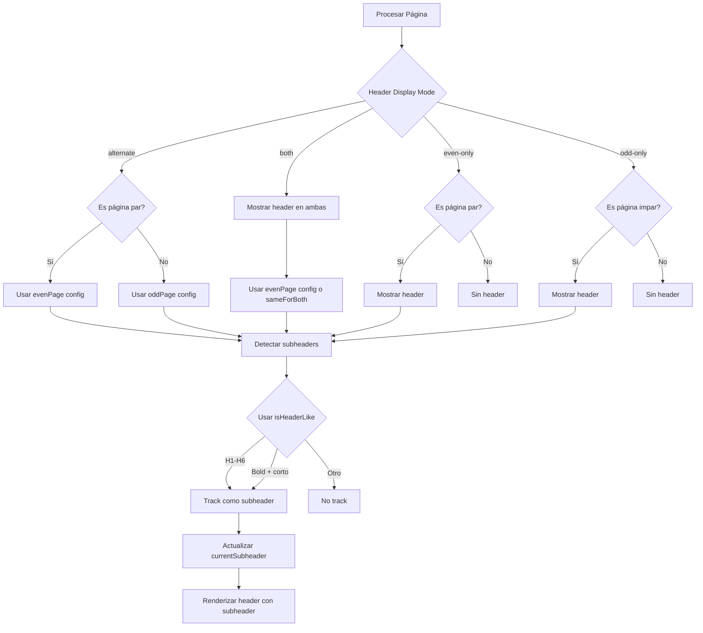

# Plan de Mejora: Sistema de Encabezados

## Problemas Identificados

1. **Headers aparecen intermitentemente**: Actualmente los headers alternan entre páginas pares e impares, pero algunos libros necesitan headers en ambas páginas.

2. **Subheaders no detectados completamente**: El algoritmo `isHeaderLike` existe pero no se usa para tracking de subheaders en los headers de página.

3. **Falta personalización**: No hay controles UI para modificar qué aparece en páginas pares vs impares.

---

## Solución Propuesta

### 1. Nueva Opción: Modo de Visualización de Headers

Añadir una opción para controlar si los headers aparecen:
- **Alternado** (actual): Pares tienen un contenido, impares otro
- **Ambas páginas**: Mismo header en todas las páginas
- **Solo pares**: Headers solo en páginas pares
- **Solo impares**: Headers solo en páginas impares

```typescript
type HeaderDisplayMode = 'alternate' | 'both' | 'even-only' | 'odd-only';
```

### 2. Tracking Mejorado de Subheaders

Usar el algoritmo `isHeaderLike` existente que detecta:
- Headers reales (H1-H6)
- Pseudo-headers (párrafos negritos cortos)

```javascript
const isHeaderLike = (el) => {
  // Real header
  if (/^H[1-6]$/i.test(el.tagName)) return true;

  // Pseudo-header: bold paragraph
  if (el.tagName === 'P' || el.tagName === 'DIV') {
    const isBold = el.style.fontWeight === 'bold' ||
                   innerHTML.includes('<strong>') ||
                   innerHTML.includes('<b>');
    const isShortText = text.length > 0 && text.length < 100;
    return isBold && isShortText;
  }
  return false;
};
```

### 3. Controles UI para Personalización

En SidebarLeft, añadir:
- Selector de modo de visualización
- Configuración independiente para páginas pares/impares
- Opción de usar mismo contenido en ambas

---

## Arquitectura de Cambios

### Archivos a Modificar

1. **`types/index.ts`**
   - Añadir `HeaderDisplayMode` type
   - Actualizar `HeaderConfig` interface

2. **`data/headerTemplates.js`**
   - Añadir `HEADER_DISPLAY_MODES` constant
   - Actualizar `DEFAULT_HEADER_CONFIG`

3. **`store/useEditorStore.ts`**
   - Añadir `headerDisplayMode` al estado inicial

4. **`components/Preview/Preview.jsx`**
   - Usar `isHeaderLike` para tracking de subheaders
   - Implementar lógica de modo de visualización

5. **`components/SidebarLeft/SidebarLeft.jsx`**
   - Añadir controles UI para modo de visualización
   - Añadir controles para personalización even/odd

---

## Diagrama de Flujo



---

## Implementación Detallada

### Fase 1: Tipos y Datos

```typescript
// types/index.ts
export type HeaderDisplayMode = 'alternate' | 'both' | 'even-only' | 'odd-only';

export interface HeaderConfig {
  enabled: boolean;
  template: HeaderTemplateId;
  displayMode: HeaderDisplayMode;  // NUEVO
  sameForBothPages: boolean;       // NUEVO: si true, usa evenPage config para ambas
  evenPage: HeaderPageConfig;
  oddPage: HeaderPageConfig;
  trackSubheaders: boolean;
  trackPseudoHeaders: boolean;     // NUEVO: detectar negritas como subheaders
  subheaderLevels: string[];
  // ... resto
}
```

### Fase 2: Constantes

```javascript
// data/headerTemplates.js
export const HEADER_DISPLAY_MODES = [
  { value: 'alternate', label: 'Alternar (par/impar)' },
  { value: 'both', label: 'Ambas páginas' },
  { value: 'even-only', label: 'Solo páginas pares' },
  { value: 'odd-only', label: 'Solo páginas impares' }
];
```

### Fase 3: Preview.jsx - Tracking Mejorado

```javascript
// Durante paginación, trackear subheaders
const trackSubheader = (el) => {
  if (!trackSubheaders) return;
  
  // Detectar headers reales
  if (/^H[1-6]$/i.test(el.tagName)) {
    const level = el.tagName.slice(1).toLowerCase();
    if (subheaderLevels.includes(level)) {
      currentSubheader = el.textContent || '';
    }
  }
  
  // Detectar pseudo-headers (negritas)
  if (trackPseudoHeaders && isHeaderLike(el)) {
    currentSubheader = el.textContent || '';
  }
};
```

### Fase 4: UI Controls

```jsx
// SidebarLeft.jsx - Nuevo acordeón o sección
<div className="header-display-mode">
  <label>Mostrar headers en:</label>
  <select value={displayMode} onChange={...}>
    {HEADER_DISPLAY_MODES.map(mode => (
      <option key={mode.value} value={mode.value}>
        {mode.label}
      </option>
    ))}
  </select>
</div>

<div className="header-content-config">
  <div className="even-page-config">
    <h4>Páginas Pares</h4>
    {/* Selectores para left/center/right */}
  </div>
  
  {displayMode === 'alternate' && (
    <div className="odd-page-config">
      <h4>Páginas Impares</h4>
      {/* Selectores para left/center/right */}
    </div>
  )}
</div>
```

---

## Tareas de Implementación

- [ ] Actualizar `types/index.ts` con nuevos tipos
- [ ] Añadir `HEADER_DISPLAY_MODES` a `headerTemplates.js`
- [ ] Actualizar `DEFAULT_HEADER_CONFIG` con nuevos campos
- [ ] Modificar `useEditorStore.ts` con estado inicial
- [ ] Implementar tracking con `isHeaderLike` en Preview.jsx
- [ ] Añadir lógica de `displayMode` en Preview.jsx
- [ ] Crear controles UI en SidebarLeft.jsx
- [ ] Probar con diferentes configuraciones
- [ ] Validar detección de pseudo-headers

---

## Consideraciones

1. **Rendimiento**: El algoritmo `isHeaderLike` ya existe y se usa para orphan detection, reutilizarlo es eficiente.

2. **Backward Compatibility**: El modo por defecto será 'alternate' para mantener comportamiento actual.

3. **UX**: Los controles deben ser intuitivos y mostrar preview en tiempo real.
