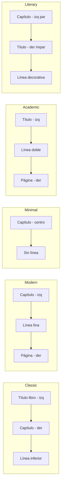
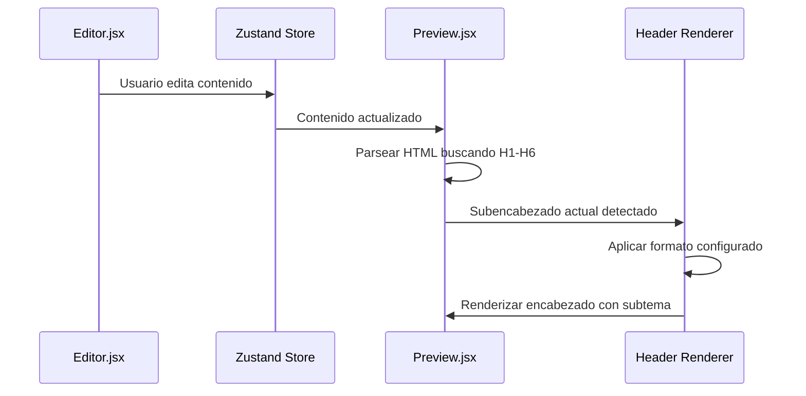

# Plan: Sistema de Encabezados Profesionales

## Resumen

Implementar un sistema de encabezados profesionales con plantillas visuales que se adapten a la paginación y vinculen subtemas (H1-H6) para mostrarlos en el encabezado de página.

---

## 1. Análisis del Problema

### Estado Actual
- Configuración básica de encabezados en [`SidebarLeft.jsx`](editorial-app/src/components/SidebarLeft/SidebarLeft.jsx:457-501)
- Solo permite: mostrar/ocultar, contenido (título/capítulo/ambos), posición, línea divisoria
- No hay plantillas visuales profesionales
- No hay vinculación con subencabezados (H1-H6)
- No hay adaptación cuando paginación está en la misma posición

### Requerimientos del Usuario
1. **Plantillas profesionales** con vista previa visual
2. **Adaptación a paginación** cuando ambos están arriba/abajo
3. **Vinculación de subtemas** - mostrar H1-H6 actual en el encabezado

---

## 2. Arquitectura Propuesta

### 2.1 Nuevos Tipos e Interfaces

```typescript
// Tipo de plantilla de encabezado
export type HeaderTemplateId = 
  | 'classic'      // Clásico: Título | Capítulo | Página
  | 'modern'       // Moderno: Línea fina + texto minimalista
  | 'minimal'      // Minimal: Solo texto, sin líneas
  | 'academic'     // Académico: Estilo tesis/universidad
  | 'literary'     // Literario: Estilo novela editorial
  | 'custom';      // Personalizado

// Configuración de encabezado por página par/impar
export interface HeaderPageConfig {
  leftContent: 'title' | 'chapter' | 'subheader' | 'page' | 'none';
  centerContent: 'title' | 'chapter' | 'subheader' | 'page' | 'none';
  rightContent: 'title' | 'chapter' | 'subheader' | 'page' | 'none';
}

// Configuración completa de encabezados
export interface HeaderConfig {
  enabled: boolean;
  template: HeaderTemplateId;
  
  // Para plantilla 'custom'
  evenPage: HeaderPageConfig;   // Páginas pares (izquierda en libro abierto)
  oddPage: HeaderPageConfig;    // Páginas impares (derecha en libro abierto)
  
  // Vinculación con subencabezados
  trackSubheaders: boolean;           // Rastrear H1-H6 actuales
  subheaderLevels: string[];          // Niveles a rastrear: ['h1', 'h2']
  subheaderFormat: 'full' | 'short' | 'numbered';  // Formato de muestra
  
  // Estilo visual
  fontFamily: 'same' | 'sans' | 'small-caps';
  fontSize: number;                   // Porcentaje del tamaño base (70-100)
  showLine: boolean;
  lineStyle: 'solid' | 'dashed' | 'dotted' | 'double';
  lineWidth: number;                  // 0.5-2pt
  lineColor: 'black' | 'gray' | 'light-gray';
  
  // Espaciado
  marginTop: number;                  // mm desde borde
  marginBottom: number;               // mm antes del contenido
  distanceFromPageNumber: number;     // mm de separación del número de página
  
  // Comportamiento con paginación
  whenPaginationSamePosition: 'stack' | 'merge' | 'separate';
}
```

### 2.2 Plantillas Predefinidas



### 2.3 Vista Previa Visual de Plantillas

```
┌─────────────────────────────────────────────────────────────┐
│  PLANTILLA CLÁSICA                                          │
│  ┌─────────────────────────────────────────────────────┐    │
│  │ El Camino del Alma              Capítulo 3: El Inicio│    │
│  │ ─────────────────────────────────────────────────── │    │
│  │                                                      │    │
│  │  El sol se levantaba sobre las montañas...          │    │
│  └─────────────────────────────────────────────────────┘    │
└─────────────────────────────────────────────────────────────┘

┌─────────────────────────────────────────────────────────────┐
│  PLANTILLA MODERNA                                          │
│  ┌─────────────────────────────────────────────────────┐    │
│  │ Capítulo 3: El Inicio                         42    │    │
│  │ ________________________________________________    │    │
│  │                                                      │    │
│  │  El sol se levantaba sobre las montañas...          │    │
│  └─────────────────────────────────────────────────────┘    │
└─────────────────────────────────────────────────────────────┘

┌─────────────────────────────────────────────────────────────┐
│  PLANTILLA ACADÉMICA                                        │
│  ┌─────────────────────────────────────────────────────┐    │
│  │ El Camino del Alma              Sección 2.1         │    │
│  │ ═══════════════════════════════════════════════════ │    │
│  │                                                      │    │
│  │  El sol se levantaba sobre las montañas...          │    │
│  └─────────────────────────────────────────────────────┘    │
└─────────────────────────────────────────────────────────────┘
```

---

## 3. Vinculación de Subencabezados

### 3.1 Flujo de Rastreo



### 3.2 Algoritmo de Detección

```javascript
// En Preview.jsx durante la paginación
function detectCurrentSubheader(pageContent, config) {
  if (!config.header.trackSubheaders) return null;
  
  const levels = config.header.subheaderLevels; // ['h1', 'h2']
  const elements = pageContent.querySelectorAll(levels.join(','));
  
  // Retornar el último subencabezado encontrado en la página
  // o el primero si no hay ninguno (heredado de página anterior)
  return elements[elements.length - 1]?.textContent || inheritedSubheader;
}
```

### 3.3 Formatos de Muestra

| Formato | Ejemplo H2: Introducción al Método |
|---------|-----------------------------------|
| `full` | Introducción al Método |
| `short` | Introducción... |
| `numbered` | 2.1 Introducción al Método |

---

## 4. Adaptación con Paginación

### 4.1 Escenarios

```mermaid
graph TB
    subgraph Ambos arriba
        A1[Header arriba] --> A2[Stack: Header arriba, Página abajo del header]
        A1 --> A3[Merge: Header y página en misma línea]
        A1 --> A4[Separate: Header, espacio, página]
    end
    
    subgraph Header arriba, Página abajo
        B1[Header arriba] --> B2[Página abajo - Sin conflicto]
    end
    
    subgraph Header abajo, Página arriba
        C1[Página arriba] --> C2[Header abajo - Sin conflicto]
    end
```

### 4.2 Configuración de Resolución

```typescript
// whenPaginationSamePosition: 'stack'
// Header arriba, número de página abajo del header
┌────────────────────────────────────┐
│ Capítulo 3                    42   │  ← Header + página merge
│ ────────────────────────────────── │
│                                    │
│ Contenido...                       │
└────────────────────────────────────┘

// whenPaginationSamePosition: 'separate'  
// Header y página en líneas diferentes
┌────────────────────────────────────┐
│ Capítulo 3                         │  ← Header
│ ────────────────────────────────── │
│                               42   │  ← Página separada
│ Contenido...                       │
└────────────────────────────────────┘
```

---

## 5. Implementación

### 5.1 Archivos a Modificar

| Archivo | Cambios |
|---------|---------|
| [`types/index.ts`](editorial-app/src/types/index.ts) | Agregar HeaderConfig, HeaderTemplateId, HeaderPageConfig |
| [`store/useEditorStore.ts`](editorial-app/src/store/useEditorStore.ts) | Agregar header config al estado inicial |
| [`components/SidebarLeft/SidebarLeft.jsx`](editorial-app/src/components/SidebarLeft/SidebarLeft.jsx) | Nuevo accordion item con selector de plantillas |
| [`components/Preview/Preview.jsx`](editorial-app/src/components/Preview/Preview.jsx) | Renderizar headers según plantilla y subencabezados |

### 5.2 Nuevo Componente: HeaderTemplateSelector

```jsx
// Componente visual para seleccionar plantilla
const HEADER_TEMPLATES = [
  {
    id: 'classic',
    name: 'Clásico',
    description: 'Título del libro a la izquierda, capítulo a la derecha',
    preview: ClassicPreview
  },
  {
    id: 'modern',
    name: 'Moderno',
    description: 'Minimalista con línea fina y número de página integrado',
    preview: ModernPreview
  },
  // ... más plantillas
];

function HeaderTemplateSelector({ value, onChange }) {
  return (
    <div className="template-grid">
      {HEADER_TEMPLATES.map(template => (
        <button
          key={template.id}
          className={`template-card ${value === template.id ? 'active' : ''}`}
          onClick={() => onChange(template.id)}
        >
          <div className="template-preview">
            <template.preview />
          </div>
          <span className="template-name">{template.name}</span>
        </button>
      ))}
    </div>
  );
}
```

### 5.3 CSS para Previews

```css
.template-grid {
  display: grid;
  grid-template-columns: repeat(2, 1fr);
  gap: 8px;
}

.template-card {
  border: 2px solid #e5e7eb;
  border-radius: 8px;
  padding: 8px;
  background: white;
  cursor: pointer;
  transition: all 0.2s;
}

.template-card.active {
  border-color: #3b82f6;
  background: #eff6ff;
}

.template-preview {
  height: 60px;
  background: #f9fafb;
  border-radius: 4px;
  display: flex;
  flex-direction: column;
  font-size: 8px;
  padding: 4px;
}
```

---

## 6. Ejemplo de Uso

### Configuración para Novela

```javascript
header: {
  enabled: true,
  template: 'literary',
  evenPage: {
    leftContent: 'title',
    centerContent: 'none',
    rightContent: 'none'
  },
  oddPage: {
    leftContent: 'none',
    centerContent: 'none',
    rightContent: 'chapter'
  },
  trackSubheaders: false,  // Novelas usualmente no tienen subtemas en header
  showLine: true,
  lineStyle: 'solid',
  lineWidth: 0.5
}
```

### Configuración para Manual Técnico

```javascript
header: {
  enabled: true,
  template: 'academic',
  evenPage: {
    leftContent: 'title',
    centerContent: 'none',
    rightContent: 'subheader'  // Muestra H2 actual
  },
  oddPage: {
    leftContent: 'subheader',  // Muestra H2 actual
    centerContent: 'none',
    rightContent: 'page'
  },
  trackSubheaders: true,
  subheaderLevels: ['h1', 'h2'],
  subheaderFormat: 'numbered',
  showLine: true,
  lineStyle: 'double'
}
```

---

## 7. Tareas de Implementación

- [ ] **Fase 1: Tipos y Store**
  - Agregar nuevos tipos en `types/index.ts`
  - Actualizar estado inicial en `useEditorStore.ts`
  
- [ ] **Fase 2: UI de Configuración**
  - Crear componente `HeaderTemplateSelector`
  - Agregar configuración de subencabezados vinculados
  - Agregar opciones de estilo visual
  
- [ ] **Fase 3: Renderizado**
  - Implementar detección de subencabezados en `Preview.jsx`
  - Renderizar headers según plantilla seleccionada
  - Manejar conflictos con paginación
  
- [ ] **Fase 4: Estilos**
  - CSS para selector de plantillas
  - CSS para previews de plantillas
  - CSS para headers renderizados

---

## 8. Consideraciones Profesionales

### Estándares Editoriales

1. **Páginas pares vs impares**: En libros profesionales, el contenido del header varía según la página sea par (izquierda) o impar (derecha)
2. **Primera página de capítulo**: Generalmente sin header
3. **Páginas en blanco**: Sin header ni número de página
4. **Verso vs recto**: El título del libro suele ir en páginas pares (izquierda), el capítulo en impares (derecha)

### Recomendaciones por Tipo de Libro

| Tipo | Plantilla Recomendada | Subencabezados |
|------|----------------------|----------------|
| Novela | Literary | No |
| Ensayo | Classic | Opcional (H1) |
| Poesía | Minimal | No |
| Manual | Academic | Sí (H1, H2) |
| Infantil | Minimal | No |

---

## 9. Preguntas para el Usuario

1. ¿Prefieres que las plantillas sean modificables o solo predefinidas?
2. ¿Qué niveles de subencabezado (H1-H6) deseas rastrear por defecto?
3. ¿Necesitas que el encabezado cambie automáticamente según el tipo de libro seleccionado?
